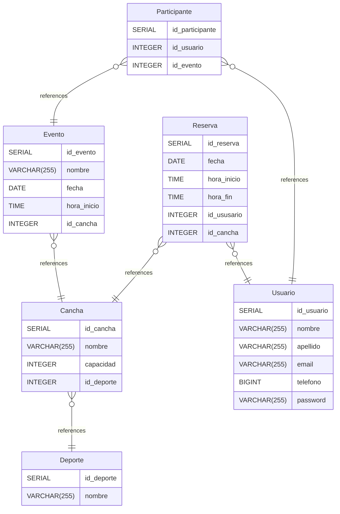

# GoSportDB documentation

## Summary

- [Introduction](#introduction)
- [Database Type](#database-type)
- [Table Structure](#table-structure)
  - [Usuario](#usuario)
  - [Deporte](#deporte)
  - [Cancha](#cancha)
  - [Evento](#evento)
  - [Reserva](#reserva)
  - [Participante](#participante)
- [Relationships](#relationships)
- [Database Diagram](#database-diagram)

## Introduction

## Database type

- **Database system:** PostgreSQL

## Table structure

### Usuario

| Name           | Type         | Settings         | References | Note |
| -------------- | ------------ | ---------------- | ---------- | ---- |
| **id_usuario** | SERIAL       | 🔑 PK, null      |            |      |
| **nombre**     | VARCHAR(255) | not null         |            |      |
| **apellido**   | VARCHAR(255) | not null         |            |      |
| **email**      | VARCHAR(255) | not null, unique |            |      |
| **telefono**   | BIGINT       | not null         |            |      |
| **password**   | VARCHAR(255) | not null         |            |      |

### Deporte

| Name           | Type         | Settings    | References | Note |
| -------------- | ------------ | ----------- | ---------- | ---- |
| **id_deporte** | SERIAL       | 🔑 PK, null |            |      |
| **nombre**     | VARCHAR(255) | not null    |            |      |

### Cancha

| Name           | Type         | Settings    | References                   | Note |
| -------------- | ------------ | ----------- | ---------------------------- | ---- |
| **id_cancha**  | SERIAL       | 🔑 PK, null |                              |      |
| **nombre**     | VARCHAR(255) | not null    |                              |      |
| **capacidad**  | INTEGER      | not null    |                              |      |
| **id_deporte** | INTEGER      | not null    | fk_Cancha_id_deporte_Deporte |      |

### Evento

| Name            | Type         | Settings    | References                 | Note |
| --------------- | ------------ | ----------- | -------------------------- | ---- |
| **id_evento**   | SERIAL       | 🔑 PK, null |                            |      |
| **nombre**      | VARCHAR(255) | not null    |                            |      |
| **fecha**       | DATE         | not null    |                            |      |
| **hora_inicio** | TIME         | not null    |                            |      |
| **id_cancha**   | INTEGER      | not null    | fk_Evento_id_cancha_Cancha |      |

### Reserva

| Name            | Type    | Settings    | References                     | Note |
| --------------- | ------- | ----------- | ------------------------------ | ---- |
| **id_reserva**  | SERIAL  | 🔑 PK, null |                                |      |
| **fecha**       | DATE    | not null    |                                |      |
| **hora_inicio** | TIME    | not null    |                                |      |
| **hora_fin**    | TIME    | not null    |                                |      |
| **id_ususario** | INTEGER | not null    | fk_Reserva_id_ususario_Usuario |      |
| **id_cancha**   | INTEGER | not null    | fk_Reserva_id_cancha_Cancha    |      |

### Participante

| Name                | Type    | Settings    | References                         | Note |
| ------------------- | ------- | ----------- | ---------------------------------- | ---- |
| **id_participante** | SERIAL  | 🔑 PK, null |                                    |      |
| **id_usuario**      | INTEGER | not null    | fk_Participante_id_usuario_Usuario |      |
| **id_evento**       | INTEGER | not null    | fk_Participante_id_evento_Evento   |      |

## Relationships

- **Cancha to Deporte**: many_to_one
- **Evento to Cancha**: many_to_one
- **Reserva to Usuario**: many_to_one
- **Reserva to Cancha**: many_to_one
- **Participante to Usuario**: many_to_one
- **Participante to Evento**: many_to_one

## Database Diagram

