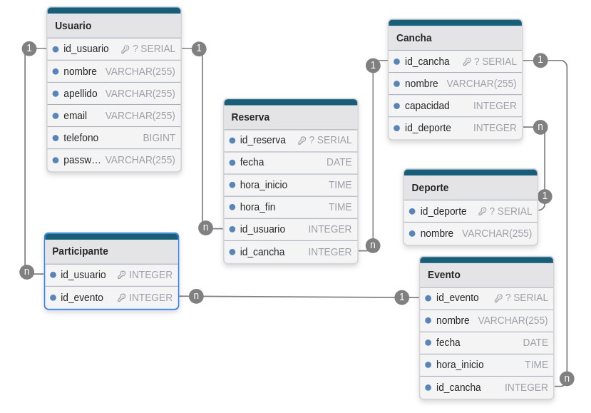

# 🏀 Go Sport - Aplicación web de Agendamientos

> 📅 Aplicación web de agendamientos de espacios deportivos construida  
> con Angular, Node.js, PostgreSQL y Docker

<video src="./resources/video_example.webm" controls width="600"></video>

## ⚙️ Inicializar

### ✅ Requisitos

- 🐳 [Docker](https://docs.docker.com/engine/install/)
- 🖥️ Tener los puertos `80` y `8080` disponibles (usados por cliente y API respectivamente)
- ⚙️ Tener configurado un archivo `.env` basado en el `example.env`

### 🧾 Clonar Repositorio

Clona el repositorio del proyecto en tu máquina local:

```bash
git clone https://github.com/Camilo-845/GoSport-scheduling-system.git
cd GoSport-scheduling-system
```

### 🔧 Preparar variables de entorno

Renombra o copia el archivo [example.env](./example.env) a un nuevo archivo que se llame `.env`

```sh
mv example.env .env
```

Antes de levantar los contenedores, ejecuta el script para configurar las variables del cliente correctamente:

```bash
./scripts/generate-config.sh
```

---

### 🚀 Iniciar contenedores

```bash
sudo docker compose up -d --build
```

- 🌐 Cliente disponible en el puerto **80**: [http://localhost](http://localhost)
- 🚀 API disponible en el puerto **8080**: [http://localhost:8080](http://localhost:8080)

---

## 📁 Estructura del proyecto

```
.
├── api/                       # Backend Node.js con TypeScript
├── client/                    # Frontend Angular 19
├── database/                  # Scripts SQL, modelo y migraciones
├── scripts/
│   └── generate-config.sh     # Script para generar archivo .env
├── terraform-azure-vm/        # Infraestructura para despliegue en Azure con Terraform
└── docker-compose.yml         # Orquestación de servicios
```

### 🧩 [Client](./client/)

Contiene la aplicación frontend desarrollada en **Angular 19**. Gestiona la interfaz de usuario, navegación, consumo de la API y estilos.

### 🚀 [API](./api/)

Backend construido con **Node.js 18** y **TypeScript**. Exposición de endpoints REST, autenticación y lógica del sistema.

### 🗄️ [DataBase](./DataBase/)

Contiene definiciones de modelos, migraciones, seeds y consultas SQL para **PostgreSQL 13**.

### ☁️ [Deploy en Azure](./terraform-azure-vm/)

Contiene la infraestructura como código usando **Terraform** para desplegar automáticamente la aplicación en una **máquina virtual de Azure**.
Incluye:

- Creación de red, grupo de recursos y VM
- Instalación automática de Docker
- Clonación del repositorio y despliegue de contenedores

Consulta [el paso a paso aquí](./terraform-azure-vm/README.md).

---

## 🧭 Puertos del Proyecto

| Componente | Puerto | URL de acceso                                    |
| ---------- | ------ | ------------------------------------------------ |
| Cliente    | `80`   | [`http://localhost`](http://localhost)           |
| API        | `8080` | [`http://localhost:8080`](http://localhost:8080) |
| PostgreSQL |        |                                                  |

---

## 🧪 Funcionamiento

### 👤 1. Autenticación de usuarios

- Los usuarios pueden **registrarse** con nombre, correo, teléfono y contraseña.
- Luego pueden **iniciar sesión** para acceder a funcionalidades protegidas.
- Endpoints:

  - `POST /auth/register`
  - `POST /auth/login`

### 📋 2. Consultas generales

- Ver deportes disponibles
- Consultar canchas habilitadas por deporte y horario
- Visualizar eventos deportivos abiertos
- Ver lista de participantes de eventos

### 🏟️ 3. Reservas deportivas

- Reservar canchas deportivas disponibles según deporte y horario
- Cancelar reservas existentes

### 📆 4. Participación en eventos

- Unirse a eventos deportivos abiertos
- Cancelar participación si no pueden asistir
- Visualizar eventos y sus participantes

---

## 🗄️ [Modelo de base de datos](./DataBase/README.md)



---
